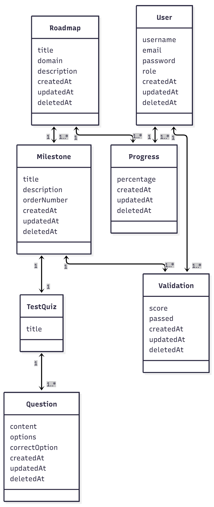
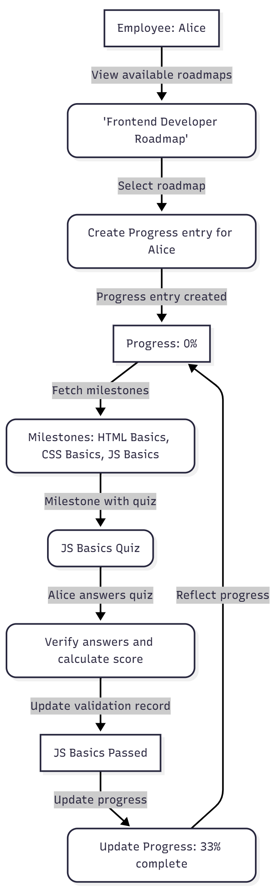

# Quiz App with NestJS


## Class Diagram


## Scenario Diagram



## Table of Contents
- [Step 1: Data Seeding](#step1)
- [Step 2: CRUD for Quiz and Questions](#step2)
- [Step 3: Answer Verification Function](#step3)
- [Step 4: Full Quiz Validation](#step4)
- [Step 5: Score Calculation](#step5)
- [Step 6: Commits and Documentation](#step6)

---

## Step 1: Data Seeding
### Terminal Command: `npm run seed`

**Goal:**  
Create initial datasets for 4 domains (Machine Learning, Security, DevOps, Network) with a total of 40 questions.

**Actions:**  
- Prepare JSON files for each domain containing 10 questions and answers.  
- Develop seeding scripts to populate the database with these questions.


---

## Step 2: CRUD for Quiz and Questions

**Goal:**  
Enable full management of quizzes and questions through CRUD operations.

**Actions:**  
- Create NestJS services and controllers for `Quiz` and `Question` entities.  
- Use TypeORM for all database operations.

---

## Step 3: Answer Verification Function

**Goal:**  
Check if the user’s submitted answers are correct.

**Actions:**  
- Add a verification method inside the `QuestionsService` to compare user answers with the correct ones.

---

## Step 4: Full Quiz Validation

**Goal:**  
Validate all quiz answers in a single operation.

**Actions:**  
- Create an API endpoint that accepts all quiz answers and returns validation results for each question.  
- Test the API with Postman.

Example JSON sent from the frontend:
```json
{
  "answers": [
    { "questionId": 1, "userAnswer": 2 },
    { "questionId": 2, "userAnswer": 3 },
    { "questionId": 3, "userAnswer": 3 },
    { "questionId": 4, "userAnswer": 3 },
    { "questionId": 5, "userAnswer": 3 },
    { "questionId": 6, "userAnswer": 3 },
    { "questionId": 7, "userAnswer": 3 },
    { "questionId": 8, "userAnswer": 3 },
    { "questionId": 9, "userAnswer": 3 },
    { "questionId": 10, "userAnswer": 3 }
  ]
}
```


---

## Step 5: Score Calculation

**Goal:**  
Compute the total quiz score as a percentage.

**Actions:**  
- Update the quiz validation function to include score calculation based on correct answers.  
- Test the feature using Postman.


---

## Step 6: Commits and Documentation

- Properly document all functionalities and project updates.  
- Use clear, descriptive commit messages for each development step.

---